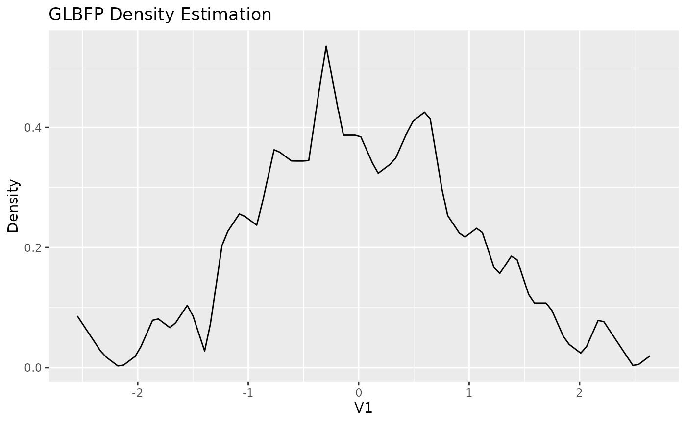
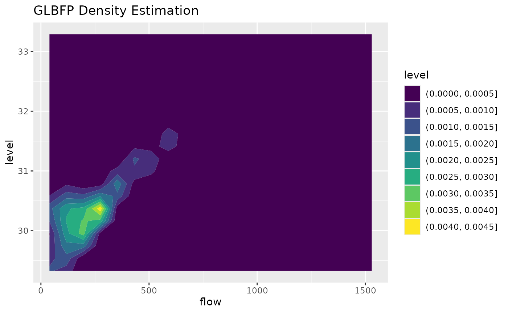

# Introduction to GLBFP

## Motivation

`GLBFP` provides nonparametric density estimators based on
histogram-style constructions that remain computationally light and
interpretable.

Use cases:

- fast exploratory density estimation,
- smooth alternatives to raw histograms,
- 1D and 2D density estimation with consistent API.

## Core functions

``` r

library(GLBFP)

data("ashua")
head(ashua)
#>   flow level     day
#> 1 50.8 29.75 1992081
#> 2 51.2 29.68 1992082
#> 3 51.2 29.75 1992083
#> 4 51.3 29.74 1992084
#> 5 51.7 29.73 1992085
#> 6 51.6 29.72 1992086
```

- [`ASH()`](https://aureliennicosiaulaval.github.io/GLBFP/reference/ASH.md)
  estimates at one point.
- [`LBFP()`](https://aureliennicosiaulaval.github.io/GLBFP/reference/LBFP.md)
  estimates at one point with linear blending.
- [`GLBFP()`](https://aureliennicosiaulaval.github.io/GLBFP/reference/GLBFP.md)
  extends LBFP with shift parameter `m`.
- `*_estimate()` runs the same estimators over a grid.

## 1D workflow

``` r

x1 <- matrix(rnorm(300), ncol = 1)
b1 <- compute_bi_optim(x1, m = 1)

fit1 <- GLBFP(x = 0, data = x1, b = b1, m = 1)
fit1
#> GLBFP Density Estimation:
#> Point: (0) 
#> Estimated density: 0.3867351 
#> Estimated standard error: 0.0838592 
#> 95% confidence interval: 0.362643259199835, 0.410826868862035 
#> Bandwidths (b): 0.155144970240404 
#> Shifts (m): 1

grid1 <- GLBFP_estimate(data = x1, b = b1, m = 1, grid_size = 100)
plot(grid1)
```



## 2D workflow

``` r

x2 <- ashua[, c("flow", "level")]
b2 <- c(8, 0.4)

fit2 <- GLBFP(x = c(mean(x2$flow), mean(x2$level)), data = x2, b = b2, m = c(1, 1))
fit2
#> GLBFP Density Estimation:
#> Point: (249.022601959444, 30.4196864889496) 
#> Estimated density: 0.003774417 
#> Estimated standard error: 0.0003167353 
#> 95% confidence interval: 0.00376917856755285, 0.00377965508177405 
#> Bandwidths (b): 8, 0.4 
#> Shifts (m): 1, 1

grid2 <- GLBFP_estimate(data = x2, b = b2, m = c(1, 1), grid_size = 20)
plot(grid2, contour = TRUE)
```



## FAQ

### How should I choose `b`?

Start with `compute_bi_optim(data, m = rep(1, d))`, then tune around
this value for your context.

### How should I choose `m`?

Use small integers first (e.g. `1` or `2`). Larger values increase
smoothing and compute time.

### What are common pitfalls?

- Missing values (`NA`) are not accepted.
- Very small samples can produce unstable tails.
- For custom `grid_points`, irregular grids are allowed but 3D surfaces
  are most interpretable with rectangular grids.
