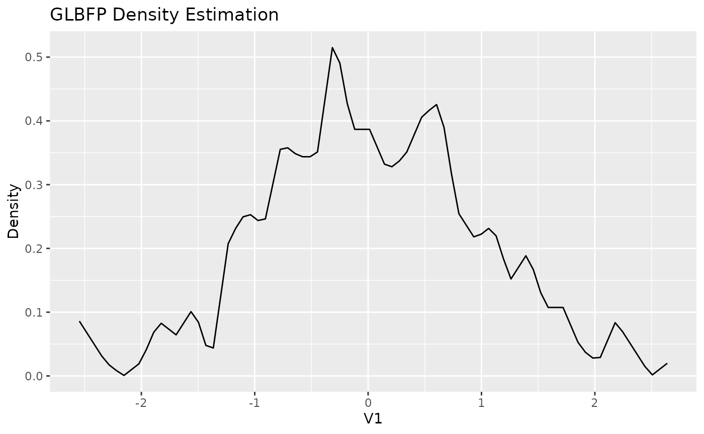
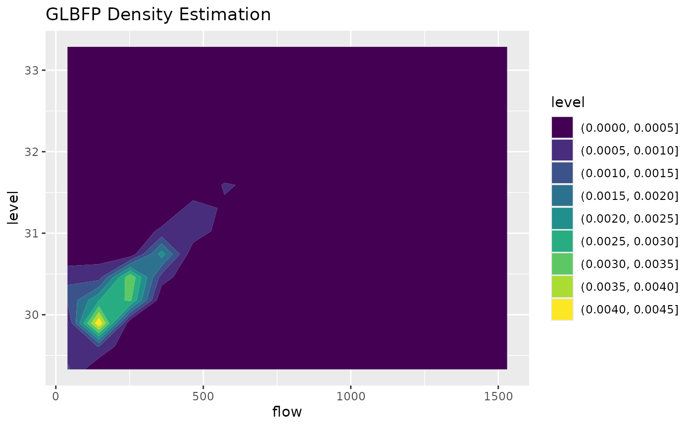

# Getting started with GLBFP

This vignette shows the basic workflow for pointwise and grid-based
density estimation with `GLBFP`.

## Installation

``` r

install.packages("remotes")
remotes::install_github("AurelienNicosiaULaval/GLBFP")
```

## Load the package

``` r

library(GLBFP)
```

## Estimate density at one point

The functions
[`ASH()`](https://aureliennicosiaulaval.github.io/GLBFP/reference/ASH.md),
[`LBFP()`](https://aureliennicosiaulaval.github.io/GLBFP/reference/LBFP.md),
and
[`GLBFP()`](https://aureliennicosiaulaval.github.io/GLBFP/reference/GLBFP.md)
estimate the density at a single point. The data are supplied as a
numeric matrix or data frame with observations in rows.

``` r

x <- matrix(rnorm(300), ncol = 1)
b <- compute_bi_optim(x, m = 1)

fit <- GLBFP(x = 0, data = x, b = b, m = 1)
fit
#> GLBFP Density Estimation:
#> Point: (0) 
#> Estimated density: 0.3867351 
#> Estimated standard error: 0.0838592 
#> 95% confidence interval: 0.362643259199835, 0.410826868862035 
#> Bandwidths (b): 0.155144970240404 
#> Shifts (m): 1
```

The returned object contains the evaluation point, the estimated
density, the bandwidth, and the shift parameter. For
[`LBFP()`](https://aureliennicosiaulaval.github.io/GLBFP/reference/LBFP.md)
and
[`GLBFP()`](https://aureliennicosiaulaval.github.io/GLBFP/reference/GLBFP.md),
uncertainty components are also returned.

``` r

names(fit)
#> [1] "x"          "estimation" "sd"         "IC"         "b"         
#> [6] "m"          "method"     "dimension"
summary(fit)
#> Method: GLBFP 
#> Dimension: 1 
#> Point: 0 
#> Estimation: 0.3867351 
#> Standard error: 0.0838592 
#> 95% CI: 0.362643259199835, 0.410826868862035
predict(fit)
#> [1] 0.3867351
```

## Estimate density on a grid

The `*_estimate()` functions evaluate the same estimator over a regular
grid or a user-supplied set of points.

``` r

grid_fit <- GLBFP_estimate(data = x, b = b, m = 1, grid_size = 80)
head(cbind(grid_fit$grid, density = grid_fit$densities))
#>             V1     density
#> [1,] -2.546881 0.085941125
#> [2,] -2.481241 0.067760688
#> [3,] -2.415601 0.049580251
#> [4,] -2.349960 0.031399814
#> [5,] -2.284320 0.017352329
#> [6,] -2.218680 0.008262111
```

For one-dimensional grids, the plot method returns a `ggplot2` object.

``` r

plot(grid_fit)
```



## Using the included data

The `ashua` data contain daily flow and level observations for the
Ashuapmushuan river. The example below uses a small grid so the vignette
remains fast.

``` r

data("ashua")

river_data <- ashua[, c("flow", "level")]
b2 <- c(8, 0.4)
x0 <- c(mean(river_data$flow), mean(river_data$level))

fit2 <- GLBFP(x = x0, data = river_data, b = b2, m = c(1, 1))
fit2
#> GLBFP Density Estimation:
#> Point: (249.022601959444, 30.4196864889496) 
#> Estimated density: 0.003774417 
#> Estimated standard error: 0.0003167353 
#> 95% confidence interval: 0.00376917856755285, 0.00377965508177405 
#> Bandwidths (b): 8, 0.4 
#> Shifts (m): 1, 1

grid_fit2 <- GLBFP_estimate(
  data = river_data,
  b = b2,
  m = c(1, 1),
  grid_size = 15
)

plot(grid_fit2, contour = TRUE)
```



## Input expectations

The package expects finite numeric data. Missing values should be
removed or imputed before estimation. Constant data require explicit
non-degenerate `min_vals` and `max_vals` bounds because a density
estimator for continuous data needs a positive evaluation range.
