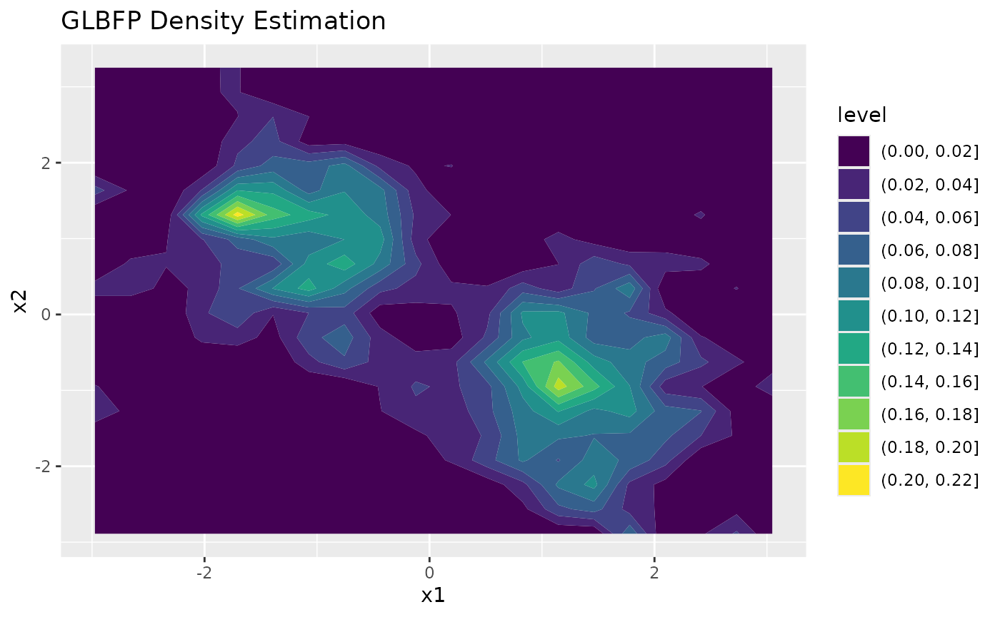

# Two-dimensional density estimation

This vignette illustrates two-dimensional density estimation and
visualization.

``` r

library(GLBFP)
```

## Simulated example

The example uses a small reproducible mixture so the vignette remains
quick to build.

``` r

n <- 250
group <- rbinom(n, size = 1, prob = 0.5)

x <- cbind(
  rnorm(n, mean = ifelse(group == 1, -1.2, 1.2), sd = 0.7),
  rnorm(n, mean = ifelse(group == 1, 1.0, -1.0), sd = 0.8)
)

colnames(x) <- c("x1", "x2")

b <- compute_bi_optim(x, m = c(1, 1))
b
#> [1] 0.3210361 0.3159536
```

## Pointwise estimation

``` r

x0 <- c(0, 0)

ash_fit <- ASH(x0, x, b = b, m = c(1, 1))
lbfp_fit <- LBFP(x0, x, b = b)
glbfp_fit <- GLBFP(x0, x, b = b, m = c(1, 1))

c(
  ASH = ash_fit$estimation,
  LBFP = lbfp_fit$estimation,
  GLBFP = glbfp_fit$estimation
)
#>        ASH       LBFP      GLBFP 
#> 0.03943508 0.01941260 0.01941260
```

## Grid estimation

``` r

grid_fit <- GLBFP_estimate(x, b = b, m = c(1, 1), grid_size = 20)
summary(grid_fit)
#> Method: GLBFP 
#> Dimension: 2 
#> Grid points: 400 
#> Density range: 0 to 0.210331281836707 
#> Density median: 0.003486427 
#> Density mean: 0.02480127
```

## Visualization

For two-dimensional regular grids, `contour = TRUE` returns a static
`ggplot2` contour plot.

``` r

plot(grid_fit, contour = TRUE)
```



With `contour = FALSE`, the plot method returns an interactive `plotly`
surface. This is useful for exploration, but static contours are usually
easier to reproduce in manuscripts.

``` r

surface <- plot(grid_fit, contour = FALSE)
surface
```

## Computational note

The number of evaluation points grows quickly with `grid_size` in two
dimensions. For manuscript figures, start with a moderate grid and
increase it only after confirming that the visual conclusions are
stable.
